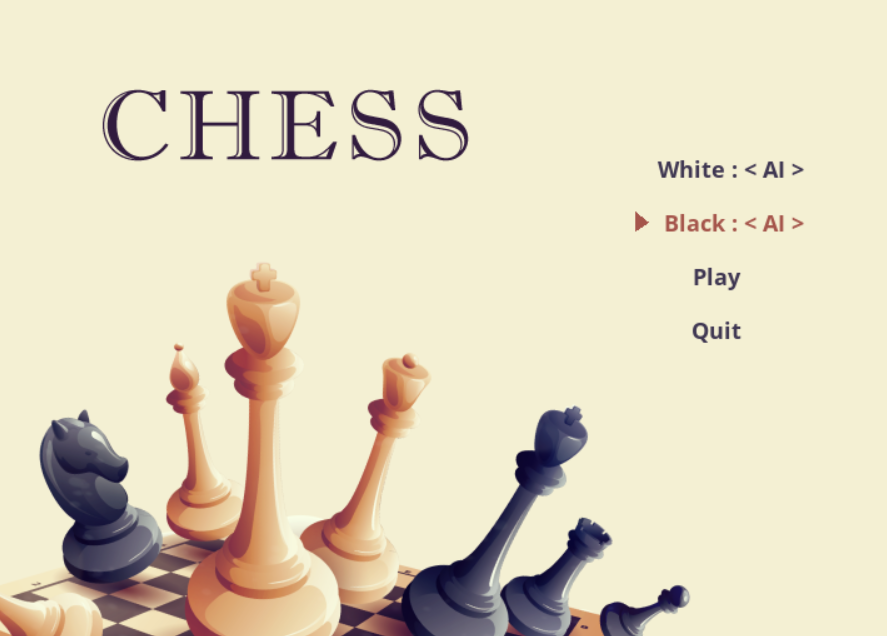

# Chess Engine

As someone who had no idea on chess, I needed a partner to learn it. What better partner than the intelligent computer? So, I taught computer to play the chess and in the same way learnt it with it. 
</br>


</br></br>

<p align="center">
    
</p>

<br/><br/>

<p align="center">
	
</p>


## Index
- [Chess](#chess)
  - [Index](#index)
  - [About](#about)
  - [Usage](#usage)
    - [Installation](#installation)
    - [Commands](#commands)

<a name="about"></a>
## About
This project is built on the python programming language, which is an interpreted high-level general-purpose programming language used to develop a chess system based on “Adversarial Search and Games.” This system uses alpha-beta pruning which is a standard minimax algorithm. 

<a name="usage"></a>
## Usage
To install this project, make sure you have the correct version of Python and Pygame. 

<a name="installation"></a>
### Installation
- Switch to Python3.
- Follow the code below to create virtual environment and install the necessary libraries.
```
git clone https://github.com/karmasta13/Chess-Engine.git
cd ./Chess-Engine/
python3 -m venv venv
source venv/bin/activate
pip install -r requirements.txt
```

<a name="commands"></a>
### Commands
- To start the game, run `python ChessMain.py`, then select the game mode you want to play in the command line.
- To undo a move, press `z`.
- To reset the board, press `r`.
